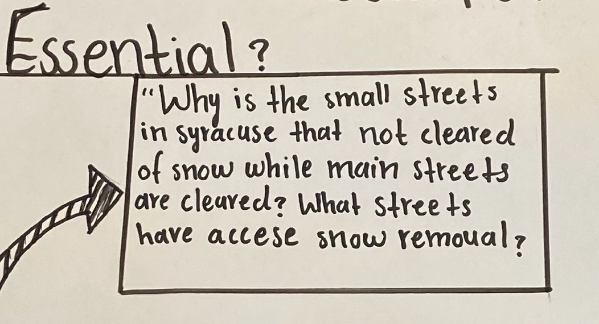
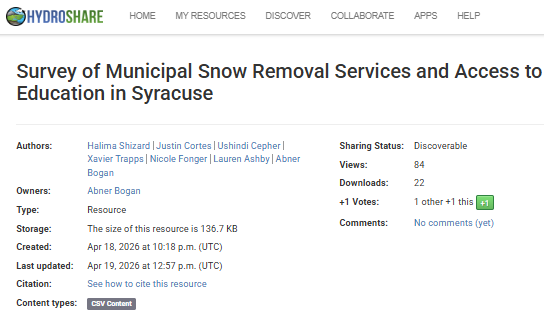

# Overview

This project was developed by a group of students in the [Data Warriors program](https://thedatawarriors.com/) at Henninger High School in Syracuse, New York. The group wanted to better understand whether students living on smaller residential streets and in different areas of Syracuse may face greater challenges getting to school in the winter than students who live on roads that are plowed more quickly. The core (or "burning") research questions the group developed at the start of the project are in @fig-burning-questions. 

{#fig-burning-questions}

<!-- This notebook walks through the process of analyzing the survey responses and combining them with other publicly available data sources, including information from the Census and the [City of Syracuse Open Data Portal](https://data.syr.gov/). These additional datasets can help explore how snow removal, neighborhood conditions, and access to school may vary across Syracuse. -->


# Investigation of inequities around municipal snow removal services

## Using publicly available data

To begin exploring these questions, the group used publicly available datasets from the [City of Syracuse Open Data Portal](https://data.syr.gov/) along with U.S. Census data. These resources helped provide additional context for understanding how neighborhood conditions may shape winter transportation experiences for students.

As one example, the group mapped median household income across Syracuse census tracts and compared these patterns with the city’s designated emergency snow routes in @fig-map-snow-inequalities. Emergency routes are typically prioritized for plowing during major snow events, which may influence how quickly roads become passable in different parts of the city.

.](images/map_income_emergency_snow_routes.png){#fig-map-snow-inequalities}

## Using collected survey data

::: {.content-hidden}

## Installing packages

```{r}
#| label: setup
#| message: false
#| warning: false

library(tidyverse)
library(scales)
source('01_download/src/get_data_from_hydroshare.R')
source('02_process/src/process_helpers.R')
source('03_visualize/src/plotting_helpers.R')
```

## Downloading survey data from HydroShare
We will programmatically download the survey data via the [HydroShare API](https://www.hydroshare.org/hsapi/). A snapshot of the resource is below. 



When running the cell below, you will be prompted to sign in to your HydroShare account. Note that you will need to have a HydroShare account (instructions on creating a HydroShare account are [here](https://help.hydroshare.org/introduction-to-hydroshare/getting-started/create-an-account/)) and have access to view the raw survey data.

```{r}
# define where we want the data to be saved as zip
out_dir_zip <- '01_download/tmp'
# define the resource id ([https://www.hydroshare.org/resource/](https://www.hydroshare.org/resource/){resource-id})
resource_id <- '60420a30cb5143c8957709a66bf2e71c'
```

```{r}
# pull data from HydroShare
get_data_from_hydroshare(resource_id,out_dir_zip)
```

# Processing survey data

## Extracting data from zip file

We first need to extract the CSV file from the zipped folder containing the survey data.

```{r}
out_dir_csv <- '02_process/out'
zip_file <- file.path(out_dir_zip,paste0(resource_id,'.zip'))
```

```{r}
file_csv <- extract_files_from_zip(zip_file,out_dir_csv,'.csv')
```

We can read in the csv file. The number of rows in the dataset correspond to the number of participants in the survey. The number of columns correspond to the number of questions.

```{r}
survey_data <- read_csv(file_csv)
num_responses <- nrow(survey_data)
```

## Developing lateness score

```{r}
lateness_score_xwalk <- tibble(response_frequency_late_to_school_snowy_conditions = c('Never',
                                                                                      'Rarely',
                                                                                      'Sometimes',
                                                                                      'Often',
                                                                                      'Very often'),
                               lateness_score = c(1,2,3,4,5))
```

We can add this score to our dataset.

```{r}
survey_data_updated <- survey_data %>% left_join(lateness_score_xwalk,by="response_frequency_late_to_school_snowy_conditions")
```

## Summarizing data across levels of snow plowing services

It will be helpful to summarize the datasets for purposes of presentation.

```{r}
# count total responses on quality of snow removal services
response_street_plowed_status_on_snowy_days_count <- count_survey_responses(survey_data_updated,response_street_plowed_status_on_snowy_days)
```

```{r}
response_usual_transportation_mode_to_school_count <- count_survey_responses(survey_data_updated,response_usual_transportation_mode_to_school,delim=",")
```

## Preparing data for visualizing

```{r}
# group by answer to question around quality of snow removal services near their home
response_street_plowed_status_on_snowy_days_poor <- survey_data_updated %>% filter(response_street_plowed_status_on_snowy_days == 'Rarely')
response_street_plowed_status_on_snowy_days_average <- survey_data_updated %>% filter(response_street_plowed_status_on_snowy_days == 'Sometimes')
response_street_plowed_status_on_snowy_days_good <- survey_data_updated %>% filter(response_street_plowed_status_on_snowy_days == 'Yes, usually')
```

```{r}
response_street_plowed_status_on_snowy_days_combined <- bind_rows(
  "Rarely" = response_street_plowed_status_on_snowy_days_poor,
  "Sometimes" = response_street_plowed_status_on_snowy_days_average,
  "Yes, Usually" = response_street_plowed_status_on_snowy_days_good,
  .id = "scenario" # This creates a column named 'scenario' filled with the names above
)
```


```{r}
# define output directory for plots
plot_dir <- "03_visualize/out"
# define filenames for saving
plot_responses_plowing_filename <- "plot_responses_plowing.png"
plot_responses_plowing_lateness_filename <- "plot_responses_plowing_lateness.png"
plot_responses_plowing_departure_filename <- "plot_responses_plowing_departure.png"
plot_responses_transportation_filename <- "plot_responses_transportation.png"
```


```{r}
color_fill <- "light sky blue"
color_outline <- "black"

font_size_title <- 15
font_size_facet <- 10
font_size_y_axis <- 11
font_size_y_title <- 11

font_size_bar <- 6

padding <- 2

# inches
plot_width <- 10
plot_height <- 8
```

## Displaying and saving plots

Now we can make our plots!

:::

To further investigate their questions, the group designed and conducted a survey for students at Henninger High School (n=`r num_responses`) focused on winter transportation experiences. Students shared data on their project through [HydroShare](https://hydroshare.org/), an open repository for sharing and discovering water-related data and research materials. 

Information about the project is available here on HydroShare: [Survey of Municipal Snow Removal Services and Access to Education in Syracuse](https://www.hydroshare.org/resource/60420a30cb5143c8957709a66bf2e71c/). The survey responses themselves are not currently public; additional consent is needed before the raw data can be shared.

The plots in @fig-survey-question-plowing, @fig-survey-question-transportation, @fig-survey-question-lateness, and @fig-survey-question-departure below are generated from the students survey data.

```{r}
#| label: fig-survey-question-plowing
#| fig-cap: "Responses to the Data Warriors survey question: _When you leave for school on snowy days, is the street near your home usually plowed?_"
plot_responses_plowing <- 
plot_bar_graph(
  data = response_street_plowed_status_on_snowy_days_count,
  num_var = "percent",
  category_var = "response_street_plowed_status_on_snowy_days",
  fill_color = color_fill,
  plot_title = "Is your street plowed before you leave for school?",
  title_size = font_size_title,
  bar_label_size = font_size_bar,
  right_padding = padding
)

print(plot_responses_plowing)
plot_responses_plowing %>% ggsave(filename=file.path(plot_dir,plot_responses_plowing_filename), width = plot_width, height = plot_height, units = "in")
```


```{r}
#| label: fig-survey-question-transportation
#| fig-cap: "Responses to the Data Warriors survey question: _How do you usually get to school? (Select all that apply)_"
plot_responses_transportation <- 
plot_bar_graph(
  data = response_usual_transportation_mode_to_school_count,
  num_var = "percent",
  category_var = "response_usual_transportation_mode_to_school",
  fill_color = color_fill,
  plot_title = "How do you get to school?",
  title_size = font_size_title,
  bar_label_size = font_size_bar,
  right_padding = padding
)

print(plot_responses_transportation)
plot_responses_transportation %>% ggsave(filename=file.path(plot_dir,plot_responses_transportation_filename), width = plot_width, height = plot_height, units = "in")
```


```{r}
#| label: fig-survey-question-lateness
#| fig-cap: "Responses to the Data Warriors survey question: _How often have you been late to school this winter because of snowy conditions?_"
plot_responses_plowing_lateness <- 
plot_boxplots(
  data = response_street_plowed_status_on_snowy_days_combined,
  y_var = "lateness_score",
  facet_var = "scenario",
  fill_color = color_fill,
  plot_title = "How often are you late due to snow?",
  y_label = "Lateness score\n (1-Never, 2-Rarely, 3-Sometimes, 4-Often, 5-Very Often)",
  title_size = font_size_title,
  facet_text_size = font_size_facet,
  y_title_size = font_size_y_title,
  y_text_size = font_size_y_axis,
  plot_subtitle = "Grouped by responses to: Is your street plowed before you leave for school?"
)

print(plot_responses_plowing_lateness)
plot_responses_plowing_lateness %>% ggsave(filename=file.path(plot_dir,plot_responses_plowing_lateness_filename), width = plot_width, height = plot_height, units = "in")
```


```{r}
#| label: fig-survey-question-departure
#| fig-cap: "Responses to the Data Warriors survey question: _What time do you usually leave home for school?_"
plot_responses_plowing_departure <- 
plot_boxplots(
  data = response_street_plowed_status_on_snowy_days_combined,
  y_var = "response_usual_departure_time_from_home",
  facet_var = "scenario",
  fill_color = color_fill,
  plot_title = "What time do you leave for school?",
  y_label = "Departure time",
  title_size = font_size_title,
  facet_text_size = font_size_facet,
  y_title_size = font_size_y_title,
  y_text_size = font_size_y_axis,
  plot_subtitle = "Grouped by responses to: Is your street plowed before you leave for school?"
)

print(plot_responses_plowing_departure)
plot_responses_plowing_lateness %>% ggsave(filename=file.path(plot_dir,plot_responses_plowing_departure_filename), width = plot_width, height = plot_height, units = "in")
```


# Discussion

From the data collected by the group, less students than expected cited that their street was rarely plowed when they leave for school in the morning on snowy days. The survey responses suggest that students who live on streets that are plowed less often may be late more often to school, but this is not conclusive. It is recommended to give this survey to a larger cohort of stuents to better understand these relationships. 

Furthermore, the group found that more detailed and publicly available information on how snow removal is prioritized across Syracuse could help support deeper research on potential inequities in access to education during winter months.


# Call to Action

One key recommendation from the group is for the City of Syracuse to make more usable public data available on how snow plowing is prioritized across neighborhoods. While the city shares general information about plow operations, there is limited accessible data beyond the [Emergency Snow Routes](https://data.syr.gov/datasets/2e3cf7dcc42a4db19a320a1655bc149d_0/explore?location=43.035043%2C-76.138805%2C13) dataset.

For example, the City of Syracuse Office of Accountability, Performance and Innovation explains how streets are prioritized during winter weather events in @fig-api-prioritization, but this information is not available and usable on Open Data Syracuse.

, February 2022. Accessed April 21, 2026._](images/city_of_syracuse_routes_and_prioritization.png){#fig-api-prioritization}

Futhermore, the city’s snow plow map shown in @fig-snow-map has improved public awareness around snow plowing in real time but does not currently provide historical data for deeper analysis.

, Februrary 2022. Accessed April 21, 2026._](images/city_of_syracuse_snow_plow_map.png){#fig-snow-map}

